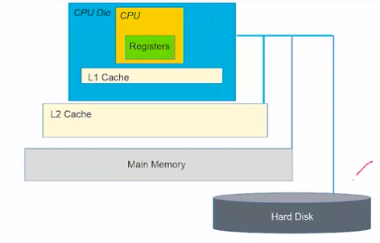

# Data Storage

### The Memory Hierarchy

* Data is stored in the secondary storage device (usually a hard disk).
* To process the data in a computer, you need to load the data into the main memory of this computing system.
* The main computing unit is the CPU (Central Processing Unit), so the CPU has to load data into caches in the CPU, and there're different levels of caches like L1, L2 and L3. Then CPU will load a smaller size of data into the registers in CPU (final form).
* Speed of processing: Registers > L1 Cache > L2 Cache > Main Memory > Hard Disk