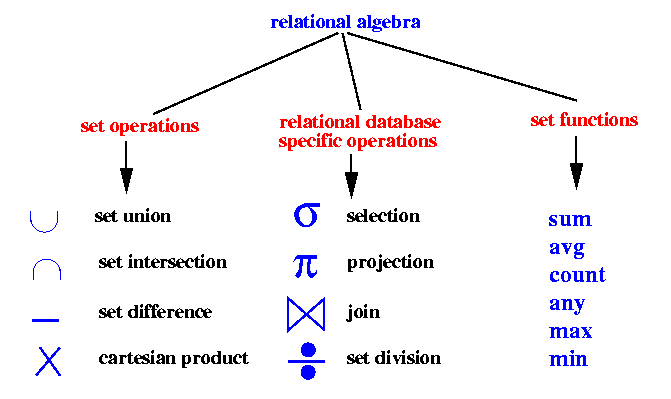

# DBMS 01. Relational Data Model

Based on [Carnegie Mellon University, 15-445/645 Intro to Database Systems, Fall 2017](https://www.youtube.com/playlist?list=PLSE8ODhjZXjYutVzTeAds8xUt1rcmyT7x)
01. Relational Data Model
02. Relational Algebra

### Intro to DBMS
* Organize collection of inter-related data that models some aspects of the real world.
* A DBMS is often confused with a database. A DBMS is a software that allows applications to store and analyze information in a database.
* A general purpose of DBMS is designed to allow the definition, creation, querying, update and administration of databases.
* DBMS types by target workloads:
    * Online transaction processing/OLTP system: fast operations that only read/update a small amount of data each time. E.g. Cassandra, MySQL, MariaDB
    * Online analytical processing/OLAP syetem: complex queries that read a lot of data to compute aggregates. E.g. Hive
    * Hybrid transaction + analytical processing: OLTP + OLAP together on the same database instance.
* DBMS types by data models:
    * Relational    (most common DBMSs)
    * Key/Value     (NoSQL)
    * Graph         (NoSQL)
    * Document      (NoSQL)
    * Column-family (NoSQL)
    * Array/ Matrix (machine Learning)
    * Hierarchical  (obsolete/rare)
    * Network       (obsolete/rare)

### Relational Model
* Integrity constraints: primary keys, foreign keys.
    * A relation's primary key is a candidate key that is deemed more **important** that other candidate keys.
* A relational model is independent of any query language implementation.
* A data model is a collection of concepts for describing the data in a database.

### Relational Algebra
* Fundamental operations to retrieve and manipulate tuples in a relation.
* Each operator takes one or more relations as its inputs and outputs a new relation.

