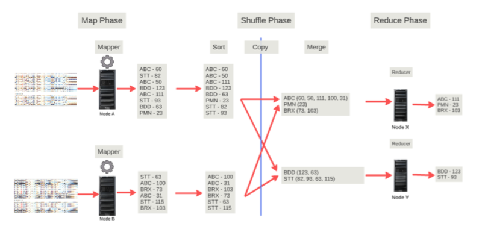

# MapReduce

* MapReduce is a **distributed programming model** for processing large data sets
* Can be implemented in any programming language
* Hadoop implements MapReduce
* MapReduce system (Hadoop) can manage communications, data transfers and parallel execution across distributed servers

### Process
1. Map phase
    1. Input splits (!= blocks): a Java class to start and end locaion within blocks
    2. Mappers
        * The number of mappers entirely dependents on the number of input splits (10 input splits -> 10 mappers)
    3. Key-Value pairs: the output of Mappers

2. Shuffle phase: the key componenet of MapReduce
    1. Sort
    2. Copy
    3. Merge (Make sure keys are unique in all partitions. Send partitions to reducers)

3. Reduce phase
    1. Reducers
        * Group key-value pairs by keys and pass it to the reduce function (reducer)
        * The number of reducers can be controlled by users
    2. Result

