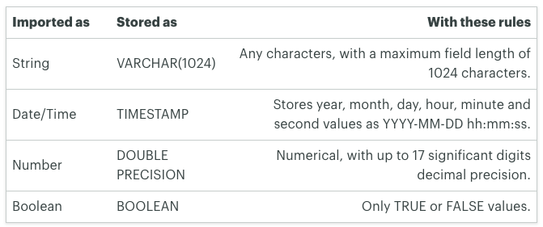

# Advanced SQL

Based on [Mode: SQL Tutorial](https://mode.com/sql-tutorial/)

### SQL Data Types
* Some basic data types [more](https://www.w3schools.com/sql/sql_datatypes.asp)

* Use **CAST** or **CONVERT** to change the data type to a numeric one that will allow you to perform the sum. Here are 2 types of syntax:

        SELECT CAST(funding_total_usd AS varchar),
                founded_at_clean::varchar
        FROM tutorial.crunchbase_companies_clean_date;

### SQL Date Format
* Arithmetic operations could be applied on date or time data types. (timestamp show as *0 years 0 mons 503 days 0 hours 0 mins 0.00 secs*)

* Add 1 week

        SELECT date,
                time,
                LEFT((date::timestamp + INTERVAL '1 week')::varchar, 10) || ' ' || time AS one_week_later
        FROM tutorial.sf_crime_incidents_2014_01;

* Calculate duration between 2 dates

        SELECT permalink,
                founded_at_clean,
                acquired_at_cleaned - founded_at_clean::timestamp AS time_to_acquisition
        FROM tutorial.crunchbase_companies_clean_date
        WHERE founded_at_clean IS NOT NULL;

* Calculate duration ~ now 

        SELECT permalink,
                founded_at_clean,
                NOW() - founded_at_clean::timestamp AS founded_time_ago
        FROM tutorial.crunchbase_companies_clean_date
        WHERE founded_at_clean IS NOT NULL;

* Combine with CASE

        SELECT companies.category_code,
                COUNT(CASE WHEN acquisitions.acquired_at_cleaned <= companies.founded_at_clean::timestamp + INTERVAL '3 years' THEN 1 ELSE NULL END) AS acquired_3_yrs,
                COUNT(CASE WHEN acquisitions.acquired_at_cleaned <= companies.founded_at_clean::timestamp + INTERVAL '5 years' THEN 1 ELSE NULL END) AS acquired_5_yrs,
                COUNT(CASE WHEN acquisitions.acquired_at_cleaned <= companies.founded_at_clean::timestamp + INTERVAL '10 years' THEN 1 ELSE NULL END) AS acquired_10_yrs,
                COUNT(1) AS total
        FROM tutorial.crunchbase_companies_clean_date companies
        JOIN tutorial.crunchbase_acquisitions_clean_date acquisitions
        ON acquisitions.company_permalink = companies.permalink
        WHERE founded_at_clean IS NOT NULL
        GROUP BY 1
        ORDER BY 5 DESC;

* EXTRACT and DATE_TRUNC

        SELECT cleaned_date,
                EXTRACT('year'   FROM cleaned_date) AS year,
                EXTRACT('month'  FROM cleaned_date) AS month,
                EXTRACT('day'    FROM cleaned_date) AS day
        FROM tutorial.sf_crime_incidents_cleandate;

        SELECT DATE_TRUNC('week', cleaned_date)::date AS week,
                COUNT(incidnt_num) AS total_incident_num
        FROM tutorial.sf_crime_incidents_cleandate
        GROUP BY week
        ORDER BY week ASC;

    * The value displayed is the first value in that period. So when you DATE_TRUNC by year, any value in that year will be listed as January 1st of that year.

            SELECT cleaned_date,
                    DATE_TRUNC('week'   , cleaned_date) AS week,
                    DATE_TRUNC('day'    , cleaned_date) AS day,
                    DATE_TRUNC('hour'   , cleaned_date) AS hour,
                    DATE_TRUNC('minute' , cleaned_date) AS minute
            FROM tutorial.sf_crime_incidents_cleandate

* Include today's date and time (could run with FROM)

        SELECT CURRENT_DATE AS date,
                CURRENT_TIME AS time,
                CURRENT_TIMESTAMP AS timestamp,
                LOCALTIME AS localtime,
                LOCALTIMESTAMP AS localtimestamp,
                NOW() AS now

    * [AT TIME ZONE](https://www.postgresql.org/docs/7.2/timezones.html)

            SELECT incidnt_num,
                    cleaned_date,
                    NOW() AT TIME ZONE 'PST' AS now,
                    NOW() AT TIME ZONE 'PST' - cleaned_date AS time_ago 
            FROM tutorial.sf_crime_incidents_cleandate;

### Using SQL String Functions to Clean Data
* [More PostgreSQL String Functions and Operators](https://www.postgresql.org/docs/9.1/functions-string.html)

* LEFT, RIGHT and LENGTH
    * You can use LEFT to pull a certain number of characters from the left side of a string and present them as a separate string. RIGHT does the same thing, but from the right side. E.g. Below lines help seperate date and time

            SELECT incidnt_num,
                    date,
                    LEFT(date, 10) AS cleaned_date,
                    RIGHT(date, LENGTH(date) - 11) AS cleaned_time
            FROM tutorial.sf_crime_incidents_2014_01;

    * The innermost functions will be evaluated first.

* TRIM
    * The TRIM function is used to remove characters from the beginning and end of a string. 

            SELECT location,
                    TRIM(both '()' FROM location)
            FROM tutorial.sf_crime_incidents_2014_01;

    * The TRIM function takes 3 arguments. 
        1. Whether you want to remove characters from the beginning (**leading**), the end (**trailing**), or both (**both**, as used above)
        2. All characters to be trimmed. Any characters included in the single quotes will be removed from both beginning, end, or both sides of the string
        3. The text you want to trim using FROM.

* POSITION and STRPOS
    * POSITION allows you to specify a substring, then returns a numerical value equal to the character number (counting from left) where that substring first appears in the target string. 

            SELECT incidnt_num,
                    descript,
                    POSITION('A' IN descript) AS a_position
            FROM tutorial.sf_crime_incidents_2014_01;

    * You can also use the STRPOS function to achieve the same results—just replace IN with a comma and switch the order of the string and substring:

            SELECT incidnt_num,
                    descript,
                    STRPOS(descript, 'A') AS a_position
            FROM tutorial.sf_crime_incidents_2014_01

    * Both the POSITION and STRPOS functions are **case-sensitive**. If you want to look for a character regardless of its case, you can make your entire string a single by using the UPPER or LOWER functions described below.

* SUBSTR

        SELECT incidnt_num,
                date, --format: mm/dd/yy
                SUBSTR(date, 4, 2) AS day
        FROM tutorial.sf_crime_incidents_2014_01;

* CONCAT

        SELECT location,
                CONCAT('(', lat, ',', lon, ')') AS concat_location
        FROM tutorial.sf_crime_incidents_2014_01;

        SELECT location,
                '(' || lat || ',' || lon || ')' AS concat_location
        FROM tutorial.sf_crime_incidents_2014_01

* UPPER and LOWER

        SELECT category,
                LEFT(category, 1) || LOWER(SUBSTR(category, 2, LENGTH(category)-1)) AS lowkey_category
        FROM tutorial.sf_crime_incidents_2014_01;

* COALESCE (To replace null values)

        SELECT incidnt_num,
                descript,
                COALESCE(descript, 'No Description')
        FROM tutorial.sf_crime_incidents_cleandate
        ORDER BY descript DESC;

### Subqueries
* Subqueries (also known as inner queries or nested queries) are a tool for performing operations in multiple steps.

        SELECT sub.category,
                AVG(sub.incidnt) AS avg_incidents_per_month
        FROM (SELECT EXTRACT('month' FROM date::timestamp) AS month,
                        category,
                        COUNT(1) AS incidnt
                FROM tutorial.sf_crime_incidents_cleandate
                GROUP BY 1,2) sub
        GROUP BY 1
        ORDER BY 2 DESC;

* Use **<sub_name>.** to fetch the data of subquery
       
        SELECT sub.*
        FROM (SELECT *
                FROM tutorial.sf_crime_incidents_2014_01
                WHERE descript = 'Warrant Arrests') sub
        WHERE sub.resolution = 'NONE';

* Subqueries in conditional logic
    * Note that you should not include an alias when you write a subquery in a conditional statement. This is because the **subquery is treated as an individual value** (or set of values in the IN case) rather than as a table.

        SELECT *
        FROM tutorial.sf_crime_incidents_2014_01
        WHERE Date = (SELECT MIN(date)
                        FROM tutorial.sf_crime_incidents_2014_01);

* [More](https://mode.com/resources/sql-tutorial/sql-subqueries/)

### SQL Window Functions
* [More](https://mode.com/resources/sql-tutorial/sql-window-functions/)

### Performance Tuning SQL Queries
* Lots of things would affect the performance of your SQL query: table size, JOINs, aggregations, other users running queries, database software and optimiztion...etc.

* Reduce table size
    * Filtering the data to include only the observations you need can dramatically improve query speed. E.g. Set WHERE constraints
    * In general, when working with subqueries, you should make sure to limit the amount of data you’re working with in the place where it will be executed first. This means **putting the LIMIT in the subquery**, not the outer query. Again, this is for making the query run fast so that you can test. NOT for producing good results.

* Make joins less complicated
    * It’s better to reduce table sizes before joining them. (e.g. subquery, WHERE)

* EXPLAIN
    * You can add EXPLAIN at the beginning of any query to get a sense of how long it will take. It’s not perfectly accurate, but it’s a useful tool.

### Pivoting Data in SQL
* [More](https://mode.com/resources/sql-tutorial/sql-pivot-table/)
