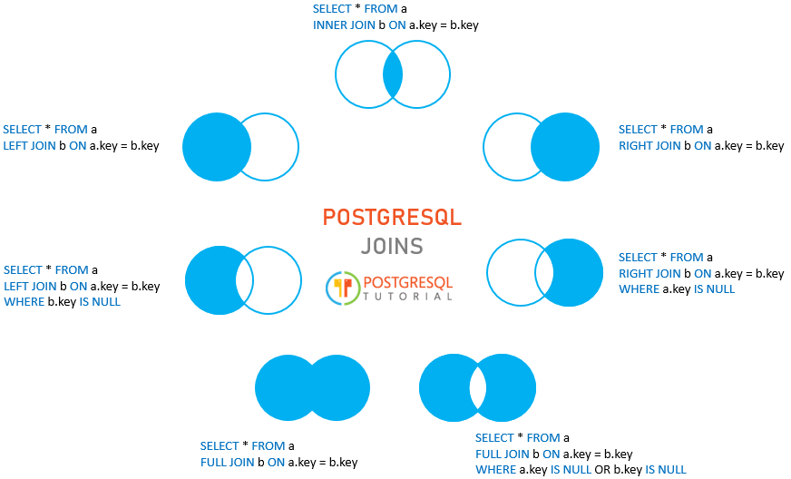

# PostgreSQL Basics: Fetch Data

* PostgreSQL, as the most advanced open source database, is so flexible that can serve as the folllowing solutions, and you can also integrate it with several analytics tools
    - a simple relational database
    - a time-series data database
    - an efficient and low-cost data warehouse

### Query Data
* SELECT
    - Avoid using * since retrieving all columns from the table increases the traffic between the database and application layers. As a result, your applications will be slow and less scalable

            SELECT
                col_1,
                col_2
            FROM
                table_name;

    - Here is an example to SELECT with expressions ( || -> concatenation operator)

            SELECT 
                first_name || ' ' || last_name AS full_name,
                email
            FROM 
                customer;

* ORDER BY (use ASC by default)

        SELECT
            col_1,
            col_2
        FROM
            table_name
        ORDER By
            col_1 ASC,
            col_2 DESC;
    - Ranking order: start from the bottom line (E.g. Rank by col_2 DESC and then rank by col_1 ASC)
    - PostgreSQL allows you to sort rows based on the columns that even does not appear in the selection list

* SELECT DISTINCT
    - To remove duplicate rows from the result set

            SELECT
                DISTINCT col_1, col_2
            FROM
                table_name;

    - Select the unique combination of bcolor and fcolor

            SELECT
                DISTINCT bcolor,
                fcolor
            FROM
                t1
            ORDER BY
                bcolor,
                fcolor;

    - Select the unique bcolor and show fcolor as well. The value of fcolor will be the first occurence paired with bcolor

            SELECT
                DISTINCT ON
                (bcolor) bcolor,
                fcolor
            FROM
                t1
            ORDER BY
                bcolor,
                fcolor;

### Filter Data
* WHERE
    - Use IN to select a column with matched value in the following list.

            SELECT
                first_name,
                last_name
            FROM
                customer
            WHERE 
                first_name IN ('Ann','Anne','Annie');

    - Return all customers whose names **start with** the string Ann

            SELECT
                first_name,
                last_name
            FROM
                customer
            WHERE 
                first_name LIKE 'Ann%';

    - Use LENGTH() function returns the number of characters of the input string

            SELECT
                first_name,
                LENGTH(first_name) name_length
            FROM
                customer
            WHERE 
                first_name LIKE 'A%' AND
                LENGTH(first_name) BETWEEN 3 AND 5
            ORDER BY
                name_length;

            SELECT 
                first_name, 
                last_name
            FROM 
                customer 
            WHERE 
                first_name LIKE 'Bra%' AND
                last_name != 'Motley';

* LIMIT
        
        SELECT
            film_id,
            title,
            release_year
        FROM
            film
        ORDER BY
            film_id
        LIMIT 4 OFFSET 3;
        - Use OFFSET to skip the first n rows

* FETCH

        SELECT
            film_id,
            title
        FROM
            film
        ORDER BY
            title 
        FETCH FIRST 1 ROW ONLY;
        - The LIMIT clause is not a SQL-standard. To conform with the SQL standard, PostgreSQL provides the FETCH clause to retrieve a portion of rows returned by a query. 

* IN
        
        SELECT
            first_name,
            last_name
        FROM
            customer
        WHERE
            customer_id IN (
                SELECT
                    customer_id
                FROM
                    rental
                WHERE
                    CAST (return_date AS DATE) = '2005-05-27'
            );
        - Use IN with a subquery

* BETWEEN

        SELECT
            customer_id,
            payment_id,
            amount,
            payment_date
        FROM
            payment
        WHERE
            payment_date BETWEEN '2007-02-07'
        AND '2007-02-15';
        - Use BETWEEN to select data in a certain period (use the literal date in ISO 8601 format)

* LIKE
    - % for matching any sequence of characters
    - _ for matching any single character
    - ILIKE operator matches value case-insensitively

            SELECT
                first_name,
                last_name
            FROM
                customer
            WHERE
                first_name ILIKE 'BAR%';

* NULL
    - To check if any value is NULL in a column, you should use xxx IS NULL. "phone = NULL" will always return false
            
            SELECT
                id,
                first_name,
                last_name,
                email,
                phone
            FROM
                contacts
            WHERE
                phone IS NULL;

* Table and column aliases
    - To make the query shorter, you can use the table aliases for the table names listed on FROM and INNER JOIN clauses. (AS could be omitted)

            SELECT t1.column_name, 
                    t2.column_name
            FROM table_name1 t1
            INNER JOIN table_name2 t2 ON join_predicate;

### Join Multiple Tables
* JOIN
    - PostgreSQL join is used to combine columns from one (self-join) or more tables based on the values of the common columns between the tables. The common columns are typically the primary key columns of the first table and foreign key columns of the second table

    

    - Below lines will return (left circle - right circle)

            SELECT
                a.id id_a,
                a.fruit fruit_a,
                b.id id_b,
                b.fruit fruit_b
            FROM
                basket_a a
            LEFT JOIN basket_b b ON a.fruit = b.fruit
            WHERE b.id IS NULL;

    - Select independent items

            SELECT
                a.id id_a,
                a.fruit fruit_a,
                b.id id_b,
                b.fruit fruit_b
            FROM
                basket_a a
            FULL OUTER JOIN basket_b b ON a.fruit = b.fruit
            WHERE a.id IS NULL OR b.id IS NULL;

    - INNER JOIN
        * For each row in the A table, PostgreSQL scans the B table to check if there is any row that matches the condition. If it finds a match, it combines columns of both rows into one row and add the combined row to the returned result set

    - SELF JOIN
        * Check examples on [http://www.postgresqltutorial.com/postgresql-self-join/](http://www.postgresqltutorial.com/postgresql-self-join/)

    - FULL [OUTER] JOIN
        * The OUTER keyword is optional

    - CROSS JOIN
        * CROSS JOIN does not have any matching condition in the join clause
        

### Group Data

        SELECT
           customer_id,
           SUM (amount)
        FROM
           payment
        GROUP BY
           customer_id
        ORDER BY
           SUM (amount) DESC;
* COUNT() is also a common aggregate function to use along with GROUP BY

        SELECT
            customer_id,
            SUM (amount)
        FROM
            payment
        GROUP BY
            customer_id
        HAVING
            SUM (amount) > 200;
* Use HAVING to set conditions

### Perform Set Operations
* Union
    - Both queries must return the same number of columns
    - The corresponding columns in the queries must have compatible data types
    - The UNION operator removes all duplicate rows unless the UNION ALL is used
    - We often use the UNION operator to combine data from similar tables that are not perfectly normalized

            SELECT
                column_1,
                column_2
            FROM
                tbl_name_1
            UNION
            SELECT
                column_1,
                column_2
            FROM
                tbl_name_2;

* INTERSECT

        SELECT
            column_list
        FROM
            A
        INTERSECT
        SELECT
            column_list
        FROM
            B;
    - The number of columns and their order in the SELECT clauses must the be the same
    - The data types of the columns must be compatible

* EXCEPT

        SELECT column_list
        FROM A
        WHERE condition_a
        EXCEPT 
        SELECT column_list
        FROM B
        WHERE condition_b;
    - Same rules as INTERSECT

### Group Sets

* http://www.postgresqltutorial.com/postgresql-grouping-sets/

### Subquery

* http://www.postgresqltutorial.com/postgresql-subquery/

### CTE, Common Table Expressions
* http://www.postgresqltutorial.com/postgresql-cte/
* A common table expression is a temporary result set which you can reference within another SQL statement including SELECT, INSERT, UPDATE or DELETE

        WITH cte_name (column_list) AS (
            CTE_query_definition 
        )
        statement;

    1. Specify the name of the CTE following by an optional column list
    2. Inside the body of the WITH clause, specify a query that returns a result set. If you do not explicitly specify the column list after the CTE name, the select list of the CTE_query_definition will become the column list of the CTE
    3. Use the CTE like a table or view in the statement which can be a SELECT, INSERT, UPDATE, or DELETE
